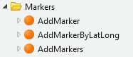

# Maker

To add a marker to the map use the AddMarker\\\* Server Actions. Simply drop these in the preparation flow, fill in the properties and the marker will be plotted on the map.

Available server actions:  

