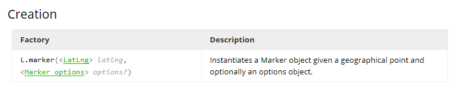
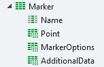

# Structures

The leaflet component uses different structures to perform its actions. All inputs that Leaflet normally requires have been placed in structures to allow the greatest amount of flexibility. If a leaflet class is depended on other leaflet class then that class is also added to the structure are a property.  
For Leaflet Objects like Markers and Circles there is one base structure. This structure includes all required properties as well as the options that you can use on the object.

## Example - Marker

If we take a look at the Leaflet documentation of Leaflet for the marker it looks like this:

If we compare this with the structure used we see the following:

In Outsystems we ask for the same information as the javascript counterpart would. So we need to specifiy the Latitude and Longitude and we can also supply several options to alter the standard behavior of the marker.

Note: Supplying the options is optional. See the section "Default Values" for more information.

### Name

In addition of the needed data we also can specify the name of the marker. This name is used internally as the javascript variable name and can be used to bing popups, events and more to the marker. You can use the available functions for this.

## Default values

Since all Leaflet objects can have options specified and we also don't want to create a hugh class definition in Javascript that would increase the pagesize all properties of the options have default values that are equal to the javascript counterpart. Only when the default value is changed the option will be added to the javascript.
