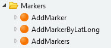

# Marker

To add a marker to the map use the AddMarker\\\* Server Actions. Simply drop these in the preparation flow, fill in the properties and the marker will be plotted on the map.

## Available server actions:

## AddMarker

### Input

- [Marker](Structures.md)\*
- LeafletMapName
- IconName

### Behavior

Draws the marker on the specified map according to the data set in the Marker parameter.

## AddMarkerByLatLong

### Input

- Latitude\*
- Longitude\*
- PopupText
- LeafletMapName
- Title
- PopupVisible
- IconName

### Behavior

Draws the marker on the specified map according to the data set in the parameters.

## AddMarkers

### Input

- [FeatureGroupMarkers](Structures.md)\*
- LeafletMapName

### Behavior

Draws all markers on the specified map according to the data set in each individual marker contained in the FeatureGroup.
